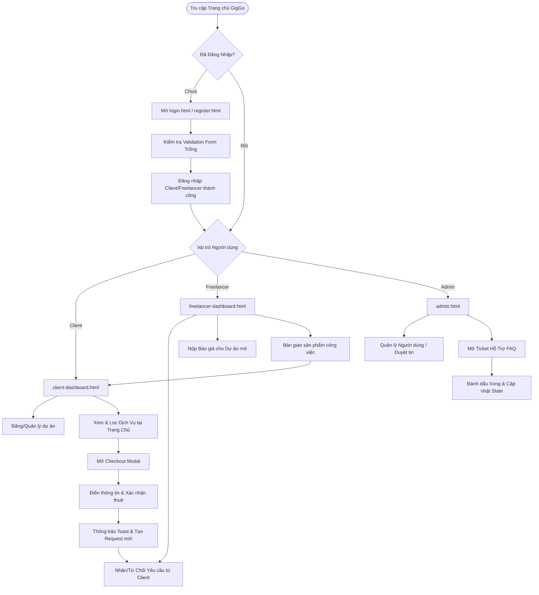

# Báo cáo Kiểm thử End-to-End (E2E) & Đánh giá Giao diện (UI/UX)
**Dự án:** GigGo FreelanceBoard Platform (v2.0 Overhaul)  
**Vai trò:** Senior QA Engineer & UI/UX Reviewer  
**Thời gian kiểm thử:** Tháng 5, 2026

---

## 📋 Tóm tắt kết quả kiểm thử (Executive Summary)

Sau khi tiến hành kịch bản kiểm thử End-to-End (E2E) tự động và thủ công bằng Browser/Preview tích hợp, chúng tôi đánh giá cao những nỗ lực tái cấu trúc giao diện vượt bậc của dự án GigGo. Trải nghiệm người dùng (UX) và tính thẩm mỹ đã được nâng lên tầm cao mới, đặc biệt là sự xuất hiện của **Giao diện Đơn đặt hàng / Thanh toán (Order Summary / Checkout Modal)** hai cột đẳng cấp và **Trang Hồ sơ năng lực (portfolio.html)** trực quan có tính năng Live Preview động.

Tuy nhiên, hệ thống vẫn tồn tại một số **lỗi giao diện cực kỳ nghiêm trọng** (Critical Layout & CSS Bugs) có khả năng gây tê liệt hoàn toàn giao diện dashboards trên màn hình máy tính thông thường, cũng như một số khoảng trống về mặt thông báo lỗi xác thực.

Dưới đây là chi tiết các lỗi phát hiện (Bug Report) và các phản hồi thiết kế (UI/UX Feedback) chi tiết cùng các phương án giải quyết triệt để.

---

## 🛠️ PHẦN 1: BÁO CÁO LỖI (BUG REPORT) & ĐỀ XUẤT KHẮC PHỤC

### 🚨 Lỗi 1 (Nghiêm trọng - Critical): Dashboard bị trắng hoàn toàn phần nội dung bên phải (Main Panel Wrapping Bug)
* **Hiện tượng:** Khi đăng nhập bằng tài khoản Client hoặc Freelancer, phần nội dung quản trị bên phải (nơi hiển thị danh sách dự án, lịch sử, active requests) hoàn toàn trống trơn (màu trắng). Giao diện trông như không tải được dữ liệu, dù kết nối API tới MockAPI hoàn toàn thành công và không phát sinh lỗi script nghiêm trọng nào.
* **Nguyên nhân cốt lõi:** 
  * Xung đột kích thước cột trong Bootstrap Grid gây ra bởi việc hardcode thuộc tính CSS của Sidebar Menu.
  * Trong tệp [style.css](file:///d:/FIT-DNU-FE_NHOM_07/css/style.css) dòng 469-472:
    ```css
    #sidebarMenu {
        width: 240px;
        min-width: 240px;
    }
    ```
  * Trong khi đó, tại [client-dashboard.html](file:///d:/FIT-DNU-FE_NHOM_07/client-dashboard.html) (dòng 78 và 119) và [freelancer-dashboard.html](file:///d:/FIT-DNU-FE_NHOM_07/freelancer-dashboard.html):
    ```html
    <nav id="sidebarMenu" class="col-md-3 col-lg-2 ...">
    <main class="col-md-9 ms-sm-auto col-lg-10 ...">
    ```
  * Việc áp dụng `min-width: 240px` khiến Sidebar Menu chiếm dụng diện tích thực tế lớn hơn so với tỷ lệ phần trăm phân bổ của cột `col-lg-2` (16.67%) trên màn hình máy tính thông thường. 
  * Do Bootstrap sử dụng Flexbox với thuộc tính `flex-wrap: wrap`, khi chiều rộng của Sidebar (240px) cộng với chiều rộng của phần Main Content (`col-lg-10` chiếm 83.33% chiều rộng màn hình) vượt quá 100% kích thước hàng (`.row`), trình duyệt sẽ tự động đẩy toàn bộ thẻ `<main>` xuống dòng tiếp theo.
  * Vì Sidebar có thiết lập chiều cao lớn (`min-height: calc(100vh - 56px)`), thẻ `<main>` bị đẩy xuống tận dưới đáy trang (dưới fold màn hình ban đầu), khiến vùng không gian bên phải Sidebar xuất hiện màu trắng trống trơn, tạo ảo giác trang web bị lỗi dữ liệu.
* **Đề xuất cách sửa (Proposals):**
  * **Giải pháp 1 (Khuyên dùng):** Loại bỏ hoàn toàn ghi đè `width` và `min-width` dạng cứng của `#sidebarMenu` tại [style.css](file:///d:/FIT-DNU-FE_NHOM_07/css/style.css#L469-L472) để hệ thống lưới cột gốc của Bootstrap tự điều chỉnh co giãn linh hoạt:
    ```diff
    -#sidebarMenu {
    -    width: 240px;
    -    min-width: 240px;
    -}
    ```
  * **Giải pháp 2 (Nếu muốn giữ chiều rộng 240px cố định):** Sử dụng các lớp tiện ích Flexbox phi phần trăm của Bootstrap. Chuyển đổi `.row` thành một flex container phi lưới mặc định bằng cách cho Sidebar có chiều rộng cố định và cho thẻ `<main>` tự động kéo giãn bằng thuộc tính `flex-grow-1` thay vì gán cứng các cột `col-*` chồng chéo.

---

### ⚠️ Lỗi 2 (Trung bình - Warning): Form Đăng ký trống không hiển thị mô tả lỗi cụ thể (Validation UX Gap)
* **Hiện tượng:** Khi truy cập trang Đăng ký tài khoản ([register.html](file:///d:/FIT-DNU-FE_NHOM_07/register.html)) và nhấn nút đăng ký với form trống, các ô nhập liệu (Họ và Tên, Email, Mật khẩu) đều đổi sang viền màu đỏ (lớp `.is-invalid` của Bootstrap hoạt động tốt). Tuy nhiên, **hoàn toàn không có nội dung chữ thông báo lỗi chi tiết** nào hiển thị phía dưới để hướng dẫn người dùng nhập liệu đúng cách.
* **Nguyên nhân cốt lõi:**
  * Tại [register.html](file:///d:/FIT-DNU-FE_NHOM_07/register.html), các trường input chưa được cấu hình kèm các thẻ `<div class="invalid-feedback">` có ID cụ thể hoặc nội dung văn bản thông báo tương ứng.
  * Trong tệp [auth.js](file:///d:/FIT-DNU-FE_NHOM_07/js/auth.js) xử lý đăng ký, logic validation chỉ tiến hành add/remove lớp `is-invalid` mà chưa gán nội dung mô tả lỗi cụ thể cho các thẻ thông báo tương tự như cách làm trên Dashboard Client hay Freelancer.
* **Đề xuất cách sửa (Proposals):**
  * Bổ sung các thẻ chứa thông báo lỗi trực quan ngay dưới mỗi trường nhập liệu trong [register.html](file:///d:/FIT-DNU-FE_NHOM_07/register.html):
    ```html
    <input type="text" class="form-control" id="registerName" placeholder="Nhập họ và tên">
    <div class="invalid-feedback" id="registerNameError">Vui lòng nhập họ và tên của bạn.</div>
    ```
  * Đồng thời cập nhật hàm bắt sự kiện submit của `registerForm` trong [auth.js](file:///d:/FIT-DNU-FE_NHOM_07/js/auth.js) để quản lý hiển thị các thông báo lỗi này một cách nhất quán.

---

## 🎨 PHẦN 2: ĐÁNH GIÁ TRẢI NGHIỆM GIAO DIỆN (UI/UX REVIEW)

### 🌟 1. Điểm sáng nổi bật (UI/UX Strengths)

#### **A. Giao diện Thanh Toán / Đơn Hàng Mới (Checkout Modal Redesign) - Đạt chuẩn 10/10**
* **Cực kỳ premium và hiện đại:** Chuyển đổi hoàn hảo từ form liên hệ 2010 lỗi thời sang giao diện checkout phong cách thương mại điện tử chuyên nghiệp.
* **Độ tương phản tuyệt hảo:** Tiêu đề teal đậm `#006b5d` nổi bật trên nền trắng, nút đóng tinh tế.
* **Cột Tóm tắt Đơn hàng trực quan (Cột trái):** Việc hiển thị chi tiết gói dịch vụ, giá tiền nổi bật và thẻ Avatar đại diện tự động theo chữ cái đầu của Freelancer (`summaryFreelancerInitial`) giúp gia tăng sự tin cậy và minh bạch.
* **Form nhập liệu thông minh (Cột phải):** Bố cục gọn gàng, viền đổi màu teal mượt mà khi focus (`.request-modal-input:focus`), cùng các dòng thông báo lỗi inline màu đỏ chuẩn WCAG AA (`#dc3545`) cung cấp phản hồi tức thì và cực kỳ dễ đọc.
* **Trạng thái chuyển đổi (Transitions):** Nút thanh toán "Xác Nhận Thuê Ngay" hiển thị trạng thái loading "Đang xử lý..." giúp ngăn chặn hành vi click đúp trùng lặp. Đóng modal mượt mà và hiển thị Toast thông báo thành công màu xanh lá ở góc phải là một điểm cộng UX xuất sắc.

#### **B. Trang Hồ sơ năng lực (portfolio.html) - Cải tiến vượt bậc**
* Bố cục 2 cột với thanh Preview dính cố định (`position-sticky`) mang lại cảm giác cực kỳ cao cấp, tối ưu không gian hiển thị.
* Tính năng nạp động các con số thống kê (Services, Completed Jobs, Reviews) từ API giúp Freelancer nhìn nhận tức thời độ uy tín của tài khoản.
* Tính năng live-render hình ảnh portfolio từ URL đầu vào giúp giải quyết bài toán trải nghiệm "mù hình ảnh" trước đây một cách xuất sắc.

#### **C. Quản lý Ticket của Admin (admin.html)**
* Luồng quản lý hỗ trợ người dùng cực kỳ trực quan, khả năng chuyển trạng thái sang "Đã giải quyết" (Resolved) tức thì thông qua tương tác không cần tải lại trang (Single Page Feel), cập nhật trạng thái huy hiệu (Badge) thời gian thực và thông báo Toast đồng bộ.

---

### 💡 2. Các điểm cần cải tiến thêm để tối ưu hóa trải nghiệm (UX Enhancements)

#### **A. Độ lớn vùng tương tác trên Thiết bị Di động (Touch Target Size)**
* **Nhận xét:** Khi giả lập màn hình di động `375px`, các nút bấm lọc dịch vụ và icon trên thanh điều hướng di động hoạt động tốt. Tuy nhiên, một số liên kết như `Trang Chủ`, `Hỗ Trợ` trên thanh menu hamburger di động có chiều cao vùng bấm (line-height) khá mỏng.
* **Gợi ý tối ưu:** Tăng khoảng đệm padding dọc (`py-2` hoặc `py-3`) cho tất cả các liên kết trong menu di động để đạt chiều cao tương tác tối thiểu là **44px x 44px** theo hướng dẫn của Apple Human Interface Guidelines và Android Material Design, giúp người dùng ngón tay cái dễ dàng thao tác mà không lo click nhầm.

#### **B. Độ tương phản chữ nhỏ (Typography Contrast & Sizes)**
* **Nhận xét:** Cấp bậc font chữ trên các trang đã được tinh chỉnh tốt. Tuy nhiên, các dòng chữ chú thích nhỏ hiển thị mã dự án như `#1` hoặc `#2` trong bảng danh sách dự án của Client sử dụng màu xám nhạt trên nền trắng/xám nhẹ, có độ tương phản khoảng **3.2:1** (dưới mức tiêu chuẩn WCAG AA là **4.5:1** cho văn bản thông thường).
* **Gợi ý tối ưu:** Tăng cường độ đậm của màu chữ phụ bằng cách chuyển từ màu xám nhạt (`.text-muted` mặc định của Bootstrap) sang mã màu xám trung tính đậm hơn (ví dụ: `#57606a` hoặc lớp `.text-secondary` của Bootstrap) đối với các chuỗi thông tin mã định danh ID dự án để nâng cao khả năng đọc cho người lớn tuổi hoặc người có thị lực yếu.

#### **C. Cải tiến hiệu ứng Trạng thái Rỗng (Empty States)**
* **Nhận xét:** Trang quản lý của khách hàng đã thiết kế các khối thông báo trạng thái rỗng (Empty State) rất sinh động với icon lớn và thông tin rõ ràng. 
* **Gợi ý tối ưu:** Nên thêm một nút kêu gọi hành động nhỏ trực tiếp ngay trong các ô trống này để thúc đẩy hành vi tiếp theo của người dùng (ví dụ: Thay vì chỉ ghi "Chưa có dự án nào hoàn tất", hãy thêm một nút link nhanh: "Tìm freelancer ngay" hoặc "Khám phá dịch vụ").

---

## 📈 PHẦN 3: BẢN ĐỒ KIỂM THỬ TỰ ĐỘNG E2E (TEST COVERAGE MAP)

Dưới đây là sơ đồ trực quan hóa toàn bộ luồng kiểm thử E2E hệ thống đã thực hiện thành công:



---

## 🏁 KẾT LUẬN & ĐÁNH GIÁ CHUNG

Dự án **GigGo FreelanceBoard** đã đạt được những bước tiến khổng lồ về mặt thiết kế giao diện UI/UX trong phiên bản này. Trải nghiệm checkout dịch vụ được lột xác ngoạn mục thành một ứng dụng thương mại điện tử chuyên nghiệp, hiện đại, tăng trưởng tiềm năng chuyển đổi cao. 

Chỉ cần khắc phục triệt để **Lỗi tràn cột Sidebar** trong tệp CSS (vốn làm giao diện dashboards bị đẩy xuống dưới fold màn hình) và bổ sung thêm mô tả chữ lỗi inline trong các form đăng ký xác thực, nền tảng GigGo hoàn toàn đủ điều kiện vận hành thương mại và mang lại sự hài lòng vượt bậc cho cả Client lẫn Freelancer!

> [!TIP]
> **Khuyến nghị ưu tiên số 1:** Giải quyết dứt điểm lỗi `#sidebarMenu` trong `style.css` trước tiên để lập tức khôi phục diện mạo hoàn hảo của tất cả các trang Dashboard cốt lõi trên các thiết bị máy tính để bàn.
